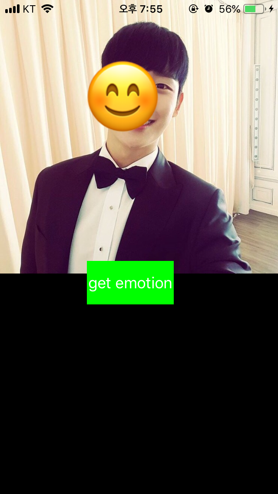
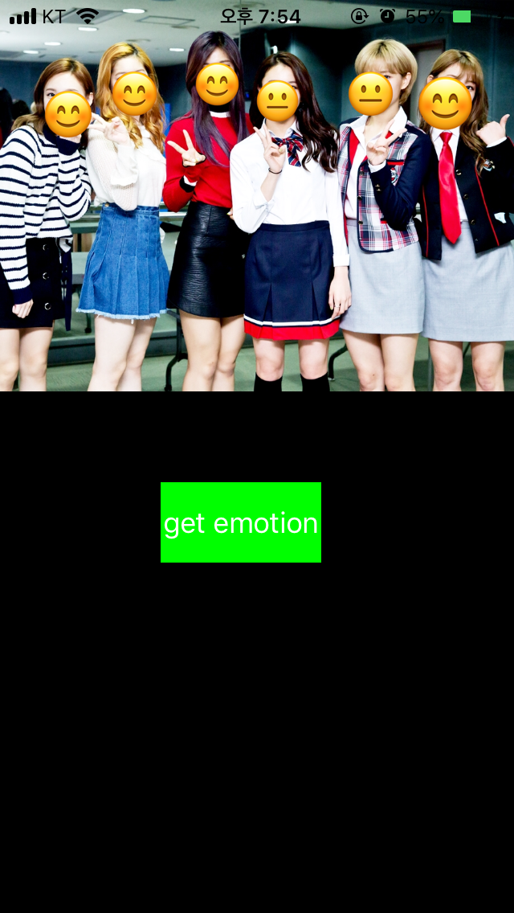
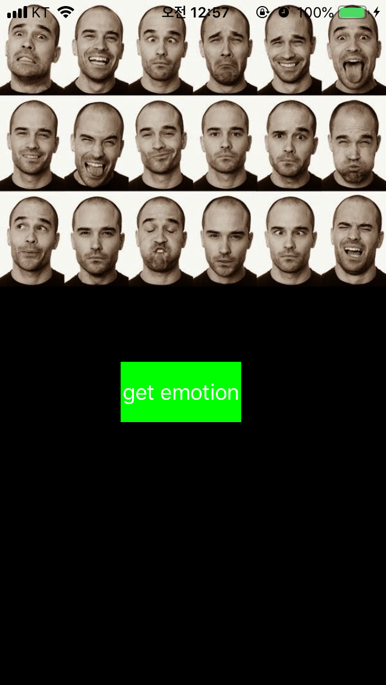
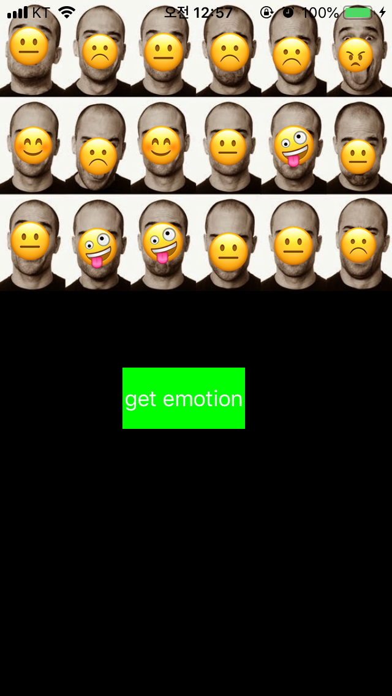
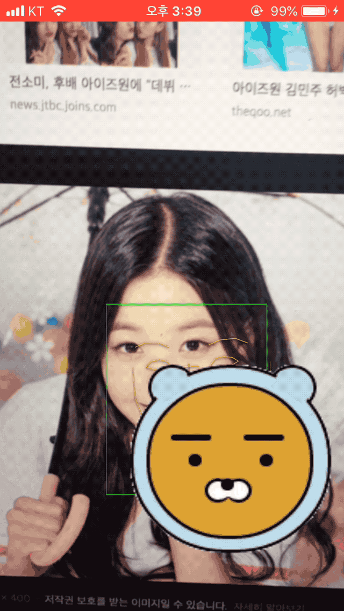

# EmojiSticker
> ### 사람 얼굴 위에 해당하는 얼굴 표정 스티커를 붙여주는 앱 

> (일단 사진으로 만들고, 이후 real time으로 수정할 예정)

1. Vision Framework를 사용하여 사진 속 얼굴을 찾고, 그 위에 빨간 네모 그려주기

	- 사진 속 얼굴이 하나일 때
	
		
	
	- 사진 속 얼굴이 여러개일 때
	
		 
	
2. Naver Clova Face API를 사용하여 사진 속 얼굴을 찾고, 그 위에 표정에 맞는 이모지 붙여주기

	- 표정 데이터 가져와서 그에 맞는 이모지 설정 & 얼굴 크기에 맞게 설정하기
	- "angry":"😠", "disgust":"☹️", "fear":"😨", "laugh":"🤣", "neutral":"😐", "sad":"😭", "surprise":"😮", "smile":"😊", "talking":"🤪"
	
		   
	
		   
		
		
3. AVCaptureVideoDataOutputSampleBufferDelegate를 이용해 이미지 face tracking 구현 (VisionFaceTrack sample 이용)

	